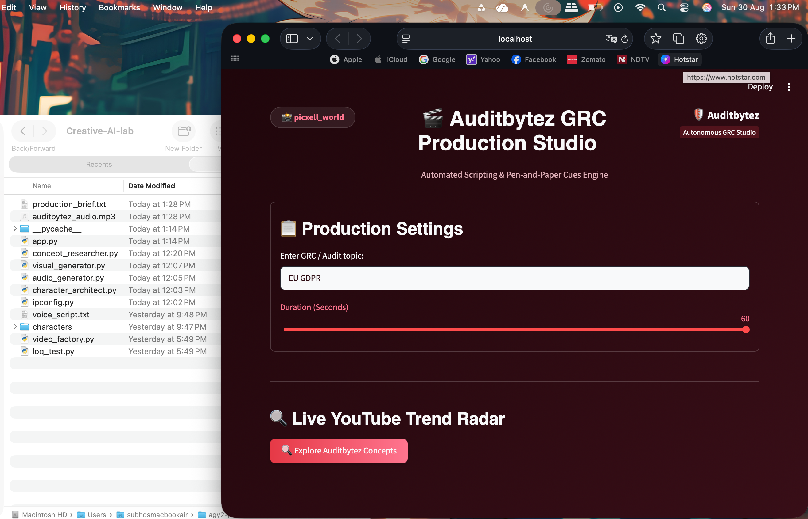
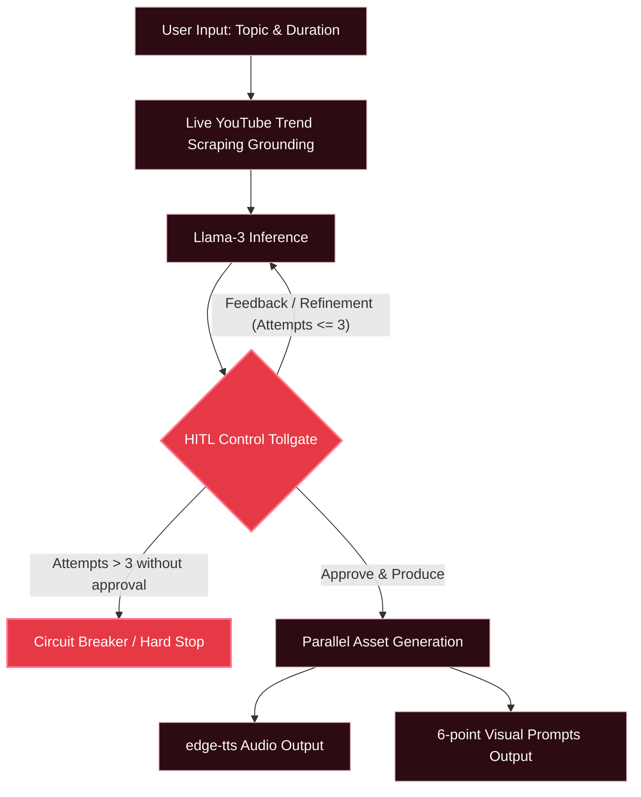

# Applied AI Governance & Operational Risk Case Study: AuditBytez GRC Production Studio

This repository houses the design, control architecture, and technical implementation of the **AuditBytez GRC Production Studio** (authored by `Subhodeep Sinha`). 

From an operational risk and system architecture perspective, this project serves as a case study in **Applied AI Governance**. It demonstrates how to deploy probabilistic Large Language Models (LLMs) inside a strictly bounded, deterministic pipeline to safely automate the generation of compliance-related content without exposing sensitive organisational metadata to public networks.

---

## 1. Executive Summary

Traditional public LLM configurations present severe operational risks to enterprise environments, notably **data exfiltration** (via public API endpoints) and **process drift** (due to unbounded model outputs). The **AuditBytez Studio** addresses these hazards by implementing a **privacy-first, locally hosted production pipeline** designed to translate complex GRC frameworks (such as SOC 1, SOC 2, ISO 27001, and GDPR) into structured educational video scripts and visual cues.

To mitigate the inherent unreliability of generative models, this architecture integrates **active grounding** (scraping live market data) and enforces strict **Control Tollgates**. Rather than granting the LLM unmonitored execution authority, the system locks the generation process behind a multi-stage **Human-in-the-Loop (HITL)** approval gate, ensuring all final scripts, audio outputs, and visual prompts meet rigorous accuracy and safety standards before deployment.

---

## 2. System Architecture & Control Flow

The diagram below represents the system data flow and demarcates standard processing steps from critical security and compliance controls.

---

## 3. Risk & Control Matrix (RCM)

This matrix maps identified AI execution risks to their corresponding system controls, defining the audit trails and guardrails established to preserve pipeline integrity.

| Risk ID | Inherent Risk Event | Control Type | Control Description / Implementation Details |
| :--- | :--- | :--- | :--- |
| **R-01** | **LLM Hallucination and Mode Collapse**  The model produces outdated, factually incorrect GRC summaries or shifts to unstructured/invalid formats that crash downstream parsers. | **Preventive** | **1. Live YouTube Data Grounding:** Feeds actual trending title/views metadata from the live market to the LLM context before inference. **2. JSON Schema Enforcement:** Restricts payload outputs using strict JSON templates, and uses a robust custom regex extractor in `concept_researcher.py` to fix formatting discrepancies (e.g. trailing commas, unescaped newlines). |
| **R-02** | **Infinite Compute Loops / Prompt Drift**  Unbounded iterations or prompt degradation resulting from successive fine-tuning runs, leading to excess resource consumption and degraded script output. | **Detective / Corrective** | **Human-in-the-Loop (HITL) 3-Iteration Circuit Breaker:** Implements a state-machine tracker within `app.py`. If the script draft is not approved within 3 iterations of user feedback, the workflow triggers a hard stop, blocking further LLM execution and prompting a reset. |

---

## 4. Technical Stack & Security Posture

The AuditBytez studio operates under a tight operational risk envelope defined by the following stack and control layout:

### Technical Stack
*   **UI Framework**: Streamlit (Bespoke Wine & Crimson studio theme)
*   **Inference Engine**: Llama-3 8B (Running offline via LM Studio)
*   **Audio Synthesis**: Asynchronous `edge-tts` (Configured to stable, human-verified neural voices `en-US-AndrewNeural` and `en-US-AvaNeural`)
*   **Grounding Module**: `youtube-search-python` (Market grounding engine)

### Security and Network Posture
*   **Zero Data Exfiltration**: By routing all model prompts to `localhost` or local subnets, the system ensures zero compliance metadata leaks to third-party model providers.
*   **Subnet Resiliency (ipconfig.py)**: To avoid hardcoding IP configurations (which compromises network configuration auditing), the system utilizes a concurrent `ThreadPoolExecutor` scan across `/24` Wi-Fi subnets to locate the local LM Studio instance dynamically.
*   **Pen-and-Paper Cues**: The visual generator enforces a non-human camera framing constraint (no human faces, no speakers). The camera focus is strictly restricted to high-contrast whiteboards and note blocks to eliminate deepfake and synthetic media liability risks.

---

## 5. Conclusion

Deploying AI systems inside production pipelines requires transitioning from probabilistic uncertainty to deterministic reliability. By framing the workflow around structured parsing fallbacks, dynamic network discovery, and human-centric feedback loops, the **AuditBytez GRC Production Studio** illustrates how organizations can capture the efficiencies of local Large Language Models without sacrificing corporate security or governance frameworks.

---
&copy; 2026 Subhodeep Sinha. All rights reserved.
